# 2023 Spring IE201 Project Part 1
# Space Kong 2001
## Vahit Yiğit Yıldız Student ID: 2022402312
## Ayşe Sena Yeşilova Student ID: 2020402195

# Contents:
- Brief Explanation of the game
- Classes
- Use-cases
- Collaboration Diagrams

# BRIEF EXPLANATION OF THE GAME

Our game is an example of the platform genre. As a player we act as 'Space Plumber' to save his 'Space Brother' from the 'Space Gorilla'.The aim of the game is to reach to the top in the shortest time possible while scoring most points. Player can move left or right, jump and climb stairs while avoiding rocks thrown from above by the Space Gorilla and aliens coming out of the alien spaceship.

# Classes

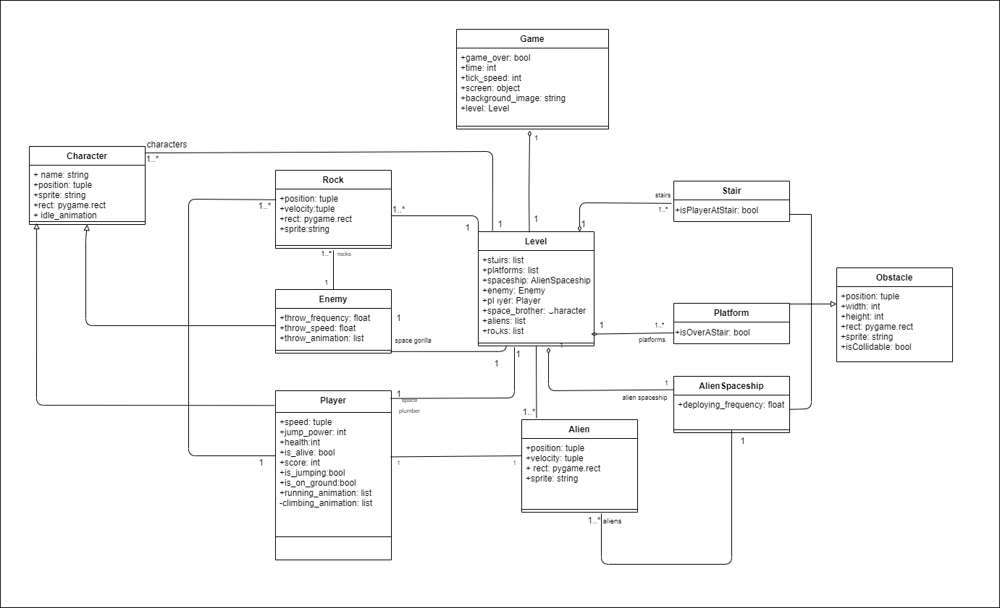

## `Character` Class
Character class is the building block of every character in the game. These characters are, Space Plumber, Space Gorilla, and Space Brother.

## `Player` Class
`Player` is the controllable object of the game and acts as the main character aka Space Plumber. `Player` object has player positions and move methods. `Player` inherits `Character` class.

## `Enemy` Class
Enemy is the antagonist of the game. `Enemy`class controls the frequency of the rocks that Space Gorilla is throwing. `Enemy` object has enemy positions and the throw method. `Enemy` inherits `Character` class.

## `Rock` Class
`Rock` class controls the movements of the rocks thrown by the Space Gorilla. `Rock` object is only created when Space Gorilla throws a rock. `Rock` object has position variables and move methods.

## `Obstacle` Class
`Obstacle` class is the building block for the level design elements. These elements are 'Platforms', 'Stairs', and 'Alien Spaceship'.

## `Platform` Class
`Platform` class is used to create the platforms for the Player to move on. `Platform` has position variables. `Platform` inherits `Obstacle`.

## `Stair` Class
`Stair` class is used to create the stairs for the Player to climb up and down. `Stair` has position variables. `Stair` inherits `Obstacle`.

## `AlienSpaceship` Class
`AlienSpaceship` class is used to create the alien spaceship that aliens deploy from. Player cannot stand on the alien spaceship. `AlienSpaceship` has position variables and deploy method. `AlienSpaceship` inherits `Obstacle`.

## `Alien` Class
`Alien` class controls the movements of the aliens deployed from the alien spaceship. `Alien` object has position variables and move methods. An `Alien` object is only created when `AlienSpaceship` deploys an alien.

## `Level` Class
`Level` class consists of everything game related. `Level` class brings every object together to create a playground. `Obstacle` objects created in the `Level` object create the map. the In the backend `Level` class keeps a track of the score.

## `Game` Class
Game class is the main class controling the flow of everything level related. It renders the level to the screen and takes user inputs.

# USE-CASES

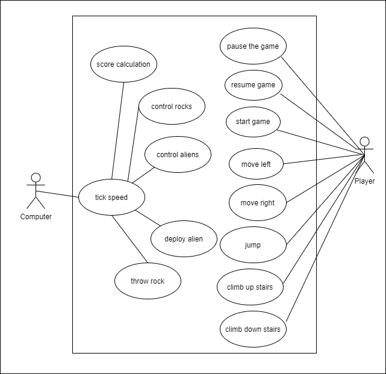

This diagram includes two actors, the Player and the Computer.
The Player actor is the user who interacts with the game and has a variety of use-cases such as:
- Start game: This use case enables the player to start the game and begins the gameplay.
- Pause game: This use case allows the player to temporarily stop the game while it's in progress. This action promps the system to freeze the game in its current state, and all the objects in the game stops moving.
- Resume game: This use-case allows the player to unfreeze the game and bring it back to its previous state before it was paused.
- Move left: This use case allows the player to move the Space Plumber to the left. When the player initiates this use case by pressing the left arrow key, the system will respond by changing the position of the Space Plumber to the left side of the screen.
- Move right: This use case allows the player to move the Space Plumber to the right. When the player initiates this use case by pressing the right arrow key, the system will respond by changing the position of the Space Plumber to the right side of the screen.
- Jump: This use case allows the player to make the Space Plumber jump. Player actor can initiate this use case by pressing the space key and the system will respond by changing its position to upwards and animating the jump movement.
- Climb down stairs: This use case allows the player to make the Space Plumber move down the stairs. When player actor initiates this use case by pressing the down arrow key, the system will respond by change its position and animating its movements.
- Climb up stairs: This use case allows the player to make the Space Plumber move up the stairs. When player actor initiates this use case by pressing the up arrow key, the system will respond by change its position and animating its movements.

The Computer actor is the system that the Player interacts with. The Computer actor performs specific actions as a response to the Player's interactions with the system. The Computer actor has use-cases such as:

- Tick Speed: This use case allows the Computer to adjust the "tick" speed, the rate at which the game logic and graphics are updated. 

# Collaboration Diagrams
## Use Case 1: Start Game
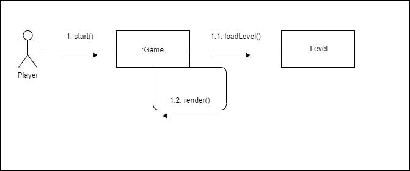

* This collaboration diagram explains the use case start game. After the game's initiation level loads and player can start playing.

## Use Case 2: Pause Game
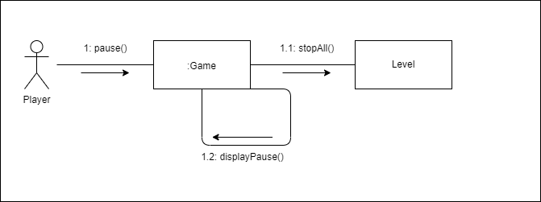

* This collaboration diagram explains the pause game use case. After `pause()` method is called everything stops and the game displays the word "Paused".

## Use Case 3: Resume Game
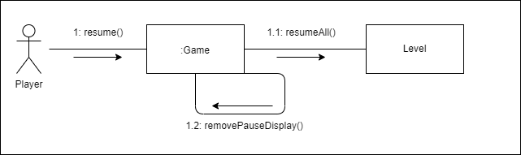

* This collaboration diagram explains the pause game use case. After `resume()` method is called everything returns to its previous state and the game stops displaying the word "Paused".

## Use Case 4: Move Left
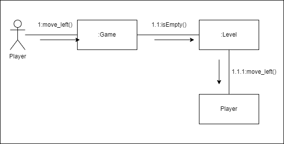

* This collaboration diagram explains how the use case "move left" works.

## Use Case 5: Move Right
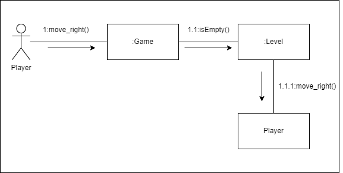

* This collaboration diagram explains how the use case "move right" works.

## Use Case 6: Jump
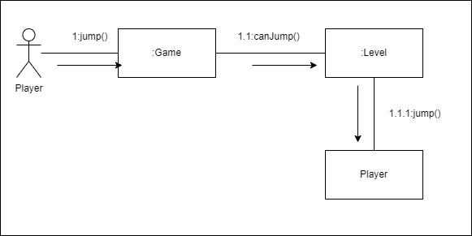

* This collaboration diagram explains how the use case "jump" works.

## Use Case 7: Climb Up
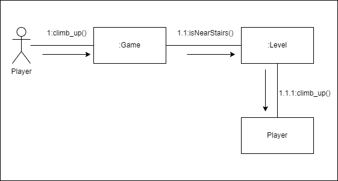

* This collaboration diagram explains how the use case "climb up" works.

## Use Case 8: Climb Down
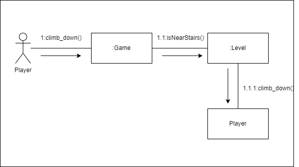

* This collaboration diagram explains how the use case "climb down" works.

## Use Case 9: Tick Speed
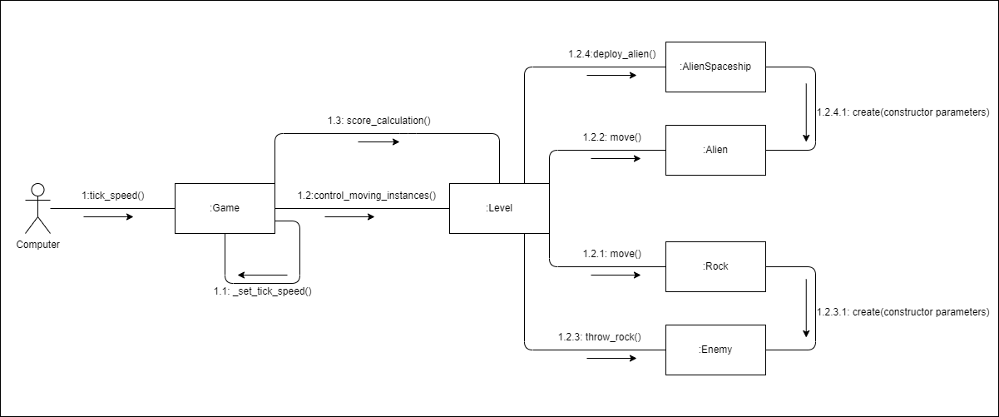

* This collaboration diagram is for the tick speed" use case. Tick speed controls every operation done by the computer. These operations are as follows:

    * Setting the tick speed to control how fast the game runs.
    * Controlling the the moving instances, nonplayable characters and the "spaceship" deploying "alien"s.
    * Calculating the player's score.